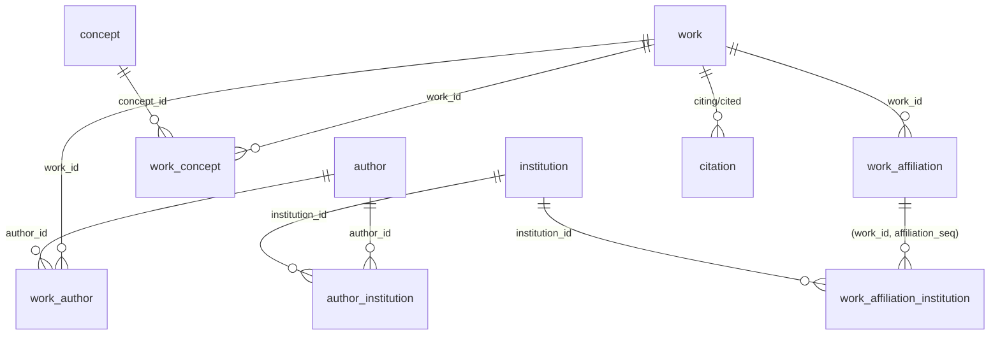

# OpenAlex (CWTS Leiden) — Table Relationships

Consult this first when writing JOINs. If it conflicts with `dictionary.csv`,
trust the CSV and update the notes column here.

**Version rule**: default `cwts-leiden.openalex_2025aug`. Any table whose
name contains `institution` uses `cwts-leiden.openalex_2024aug`.

## Logical foreign keys

| from table | column(s) | to table | to column | notes |
|---|---|---|---|---|
| citation | citing_work_id | work | work_id | citing side |
| citation | cited_work_id  | work | work_id | cited side |
| work_author | (work_id, author_seq) | work | work_id | composite; seq is 1..N per work |
| work_author | author_id | author | author_id | |
| work_author | author_position_id | author_position | author_position_id | first/middle/last |
| work_concept | (work_id, concept_seq) | work | work_id | `score` = relevance |
| work_concept | concept_id | concept | concept_id | |
| work_affiliation | (work_id, affiliation_seq) | work | work_id | one row per author-affiliation on a work |
| work_affiliation_institution | (work_id, affiliation_seq) | work_affiliation | (work_id, affiliation_seq) | **2024aug** |
| work_affiliation_institution | institution_id | institution | institution_id | **2024aug** |
| author_institution | author_id | author | author_id | historical affiliations |
| author_institution | institution_id | institution | institution_id | **2024aug** |
| author_last_known_institution | author_id | author | author_id | |
| author_last_known_institution | last_known_institution_id | institution | institution_id | **2024aug** |
| institution | institution_type_id | institution_type | institution_type_id | **2024aug** |
| institution | country_iso_alpha2_code | country | country_iso_alpha2_code | **2024aug** |
| institution | geonames_city_id | city | geonames_city_id | **2024aug** |
| concept_ancestor | concept_id | concept | concept_id | hierarchy edge |
| concept_ancestor | ancestor_concept_id | concept | concept_id | |

## Mermaid (core entities, illustrative)

The full ER diagram is in `assets/database_diagram.svg` — do **not** load it
into an agent context wholesale (2.8 MB).
